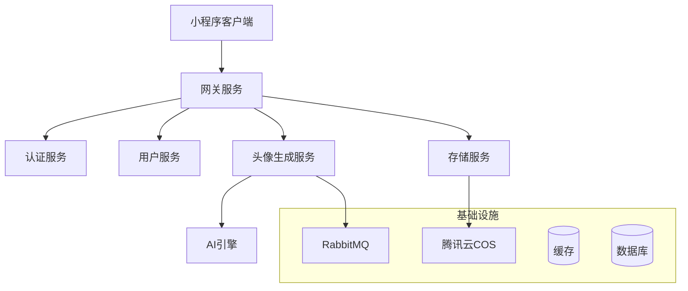

# AI头像生成小程序

## 项目概述
基于AI技术的头像生成小程序，面向年轻用户群体、宠物爱好者及轻量级创作者，提供个性化、高质量的头像生成服务。

## 技术架构

### 前端技术栈
- 框架：Taro 3.x
- 状态管理：Mobx
- UI组件库：NutUI
- 类型检查：TypeScript
- 样式处理：SCSS
- 构建工具：Webpack
- 包管理：pnpm

### 后端技术栈
- 核心框架：Spring Boot 2.7.x
- 微服务框架：Spring Cloud Alibaba
- 认证授权：Spring Security + JWT
- 数据访问：MyBatis Plus
- 数据库：MySQL 8.0
- 缓存：Redis
- 消息队列：RabbitMQ
- 对象存储：腾讯云 COS
- AI服务：腾讯云AI接口

## 系统架构
系统采用微服务架构，主要包含以下服务：
- 网关服务：统一入口、请求路由、限流控制
- 用户服务：用户管理、会员系统、订单支付
- 头像生成服务：图片处理、AI模型调用、异步任务处理
- 存储服务：文件上传下载、资源管理、CDN分发

### 架构图

## 核心功能
- 图片上传与处理
- 智能风格转换
- 细节参数调整
- 用户系统管理
- 社交分享功能

## 性能指标
- 图片生成响应时间：≤ 10秒
- 并发用户支持：≥ 1000
- 图片压缩质量：≤ 2MB
- 小程序包体积：≤ 8MB

## 安全特性
- 用户数据加密存储
- 微信登录授权
- 防刷机制
- 内容安全审核 