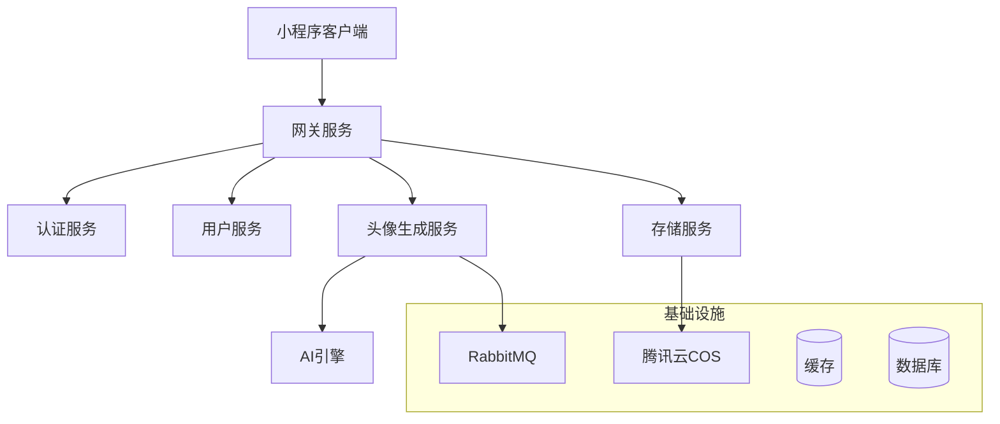
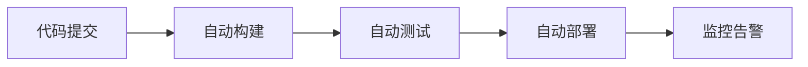

# AI头像生成小程序架构设计文档

## 1. 整体技术架构

### 1.1 技术选型

#### 前端技术栈
- 框架：Taro 3.x
- 状态管理：Mobx
- UI组件库：NutUI
- 类型检查：TypeScript
- 样式处理：SCSS
- 构建工具：Webpack
- 包管理：pnpm

#### 后端技术栈
- 核心框架：Spring Boot 2.7.x
- 微服务框架：Spring Cloud Alibaba
- 认证授权：Spring Security + JWT
- 数据访问：MyBatis Plus
- 数据库：MySQL 8.0
- 缓存：Redis
- 消息队列：RabbitMQ
- 对象存储：腾讯云 COS
- AI服务：腾讯云AI接口

### 1.2 系统架构图



## 2. 前端架构设计

### 2.1 目录结构 

### 2.2 核心组件设计

#### 2.2.1 业务组件
- `ImageUploader`: 图片上传组件
- `StyleSelector`: 风格选择组件
- `ImageEditor`: 图片编辑组件
- `PreviewCanvas`: 预览画布组件
- `AdjustmentPanel`: 调整面板组件
- `SharePanel`: 分享面板组件

#### 2.2.2 状态管理
```typescript
// store/avatar.ts
interface AvatarStore {
  originalImage: string;
  currentStyle: StyleType;
  editingParams: EditParams;
  generatedImage: string;
  generateStatus: 'idle' | 'generating' | 'success' | 'error';
}
```

## 3. 后端架构设计

### 3.1 微服务模块

#### 3.1.1 网关服务 (gateway-service)
- 统一入口
- 请求路由
- 限流控制
- 认证鉴权

#### 3.1.2 用户服务 (user-service)
- 用户管理
- 会员系统
- 订单支付

#### 3.1.3 头像生成服务 (avatar-service)
- 图片处理
- AI模型调用
- 异步任务处理

#### 3.1.4 存储服务 (storage-service)
- 文件上传下载
- 资源管理
- CDN分发

### 3.2 数据库设计

#### 3.2.1 用户表 (t_user)
```sql
CREATE TABLE t_user (
    id BIGINT PRIMARY KEY,
    open_id VARCHAR(64) NOT NULL,
    nick_name VARCHAR(32),
    avatar_url VARCHAR(256),
    member_type TINYINT,
    member_expire_time DATETIME,
    created_time DATETIME,
    updated_time DATETIME,
    UNIQUE KEY uk_open_id (open_id)
);
```

#### 3.2.2 头像记录表 (t_avatar_record)
```sql
CREATE TABLE t_avatar_record (
    id BIGINT PRIMARY KEY,
    user_id BIGINT NOT NULL,
    original_image_url VARCHAR(256),
    style_type VARCHAR(32),
    params JSON,
    result_image_url VARCHAR(256),
    status TINYINT,
    created_time DATETIME,
    updated_time DATETIME,
    INDEX idx_user_id (user_id)
);
```

### 3.3 接口设计

#### 3.3.1 RESTful API规范
- 使用HTTP动词表示操作类型
- 使用复数名词表示资源集合
- 版本号放在URL中
- 使用查询参数进行过滤和分页

#### 3.3.2 核心接口

## 4. 关键技术实现

### 4.1 图片处理流程
1. 前端压缩上传
2. 后端图片验证
3. AI模型处理
4. 结果异步回调

### 4.2 异步任务处理

#### 4.2.1 RabbitMQ配置
```java
@Configuration
public class RabbitMQConfig {
    public static final String AVATAR_EXCHANGE = "avatar.exchange";
    public static final String AVATAR_QUEUE = "avatar.generation.queue";
    public static final String AVATAR_ROUTING_KEY = "avatar.generation";

    @Bean
    public DirectExchange avatarExchange() {
        return new DirectExchange(AVATAR_EXCHANGE);
    }

    @Bean
    public Queue avatarQueue() {
        return QueueBuilder.durable(AVATAR_QUEUE)
                .withArgument("x-dead-letter-exchange", "avatar.dlx")
                .withArgument("x-dead-letter-routing-key", "avatar.dlq")
                .build();
    }

    @Bean
    public Binding binding(Queue avatarQueue, DirectExchange avatarExchange) {
        return BindingBuilder.bind(avatarQueue)
                .to(avatarExchange)
                .with(AVATAR_ROUTING_KEY);
    }
}
```

#### 4.2.2 消息生产者
```java
@Service
@Slf4j
public class AvatarTaskProducer {
    @Autowired
    private RabbitTemplate rabbitTemplate;

    public void sendGenerationTask(AvatarGenerationTask task) {
        rabbitTemplate.convertAndSend(
            RabbitMQConfig.AVATAR_EXCHANGE,
            RabbitMQConfig.AVATAR_ROUTING_KEY,
            task,
            message -> {
                message.getMessageProperties().setDeliveryMode(MessageDeliveryMode.PERSISTENT);
                return message;
            }
        );
    }
}
```

#### 4.2.3 消息消费者
```java
@Component
@Slf4j
public class AvatarTaskConsumer {
    @RabbitListener(queues = RabbitMQConfig.AVATAR_QUEUE)
    public void handleGenerationTask(AvatarGenerationTask task) {
        try {
            // 处理头像生成任务
            processAvatarGeneration(task);
        } catch (Exception e) {
            log.error("处理头像生成任务失败", e);
            // 任务失败处理逻辑
        }
    }
}
```

### 4.3 对象存储实现

#### 4.3.1 腾讯云COS配置
```java
@Configuration
@ConfigurationProperties(prefix = "cos")
@Data
public class COSConfig {
    private String secretId;
    private String secretKey;
    private String region;
    private String bucketName;
    
    @Bean
    public COSClient cosClient() {
        COSCredentials credentials = new BasicCOSCredentials(secretId, secretKey);
        ClientConfig clientConfig = new ClientConfig(new Region(region));
        return new COSClient(credentials, clientConfig);
    }
}
```

#### 4.3.2 存储服务实现
```java
@Service
@Slf4j
public class StorageServiceImpl implements StorageService {
    @Autowired
    private COSClient cosClient;
    
    @Autowired
    private COSConfig cosConfig;

    @Override
    public String uploadFile(MultipartFile file, String path) {
        try {
            ObjectMetadata metadata = new ObjectMetadata();
            metadata.setContentLength(file.getSize());
            metadata.setContentType(file.getContentType());
            
            PutObjectRequest request = new PutObjectRequest(
                cosConfig.getBucketName(),
                path,
                file.getInputStream(),
                metadata
            );
            
            cosClient.putObject(request);
            
            return getFileUrl(path);
        } catch (Exception e) {
            log.error("文件上传失败", e);
            throw new BusinessException("文件上传失败");
        }
    }

    @Override
    public String getFileUrl(String path) {
        return String.format("https://%s.cos.%s.myqcloud.com/%s",
            cosConfig.getBucketName(),
            cosConfig.getRegion(),
            path);
    }
}
```

#### 4.3.3 文件上传策略
```java
@Component
public class FileUploadStrategy {
    @Autowired
    private StorageService storageService;

    public String uploadAvatar(MultipartFile file, String userId) {
        // 生成文件路径
        String path = String.format("avatars/%s/%s.%s",
            userId,
            UUID.randomUUID().toString(),
            getFileExtension(file.getOriginalFilename())
        );
        
        // 上传文件
        return storageService.uploadFile(file, path);
    }

    private String getFileExtension(String filename) {
        return Optional.ofNullable(filename)
            .filter(f -> f.contains("."))
            .map(f -> f.substring(filename.lastIndexOf(".") + 1))
            .orElse("jpg");
    }
}
```

### 4.4 缓存策略
- 用户信息缓存
- 会员权益缓存
- 生成结果缓存
- 热门风格缓存

## 5. 安全设计

### 5.1 数据安全
- 敏感数据加密
- 图片水印处理
- 防盗链措施
- 数据备份策略

### 5.2 接口安全
- JWT认证
- 请求签名
- 接口限流
- 防重放攻击

## 6. 性能优化

### 6.1 前端优化
- 图片懒加载
- 组件按需加载
- 本地缓存
- 预加载策略

### 6.2 后端优化
- 接口缓存
- 数据库索引
- 连接池管理
- 分布式缓存
- RabbitMQ消息持久化
- COS文件分片上传
- COS CDN加速

## 7. 部署架构

### 7.1 部署环境
- 开发环境 (dev)
- 测试环境 (test)
- 预发环境 (pre)
- 生产环境 (prod)

### 7.2 CI/CD流程


## 8. 监控告警

### 8.1 监控指标
- 接口响应时间
- 服务器资源使用
- 业务指标监控
- 错误日志监控

### 8.2 告警策略
- 服务可用性告警
- 性能阈值告警
- 业务异常告警
- 安全事件告警

这份架构设计文档涵盖了：
1. 完整的技术栈选型
2. 清晰的前后端架构设计
3. 详细的数据库表结构
4. 规范的RESTful API设计
5. 完整的部署和监控方案

文档遵循了：
1. 微信小程序开发规范
2. Taro框架最佳实践
3. 阿里巴巴Java开发规范
4. RESTful API设计规范

如果你需要对某个具体部分进行补充或修改，请告诉我。